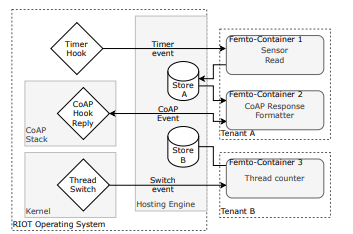
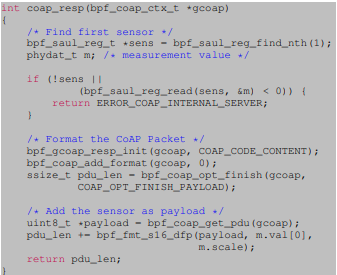

# Commonly Evaluated Workflows

[Main Page](../README.md)

These are the worflows that were used for performance evaluation of the
solutions discussed in the papers:

- Femto-containers:
  - Fletcher32 checksumming algorithm
    application.
  - Thread counter code (inserted on a critical path)
  ```
  # include < stdint .h >
  # include " bpf / bpfapi / helpers .h "
  # define THREAD_START_KEY 0 x0
  #include " bpf / bpfapi / helpers .h "
  #include < stdint .h >
  #define THREAD_START_KEY 0 x0
    typedef struct {
      uint64_t previous; /* previous thread */
      uint64_t next;     /* next thread */
    } sched_ctx_t;
    int pid_log(sched_ctx_t *ctx) {
      /* Zero pid means no next thread */
      if (ctx - > next != 0) {
        uint32_t counter;
        uint32_t thread_key = THREAD_START_KEY + ctx - > next;
        bpf_fetch_global(thread_key, &counter);
        counter++;
        bpf_store_global(thread_key, counter);
      }
      return 0;
    }
  ```
  - Network sensor code - CoAP response formatter

    Femtocontainers paper: *The last example shows the duration of the second
    stage of the networked sensor code example[21]. It depends heavily on system
    calls for formatting of the CoAP response, but still contains some processing
    inside the VM. It can be considered a representative example for business
    logic on the device*

    

- rBPF Paper
  - They also test the Fletcher32 checksumming algorithm
  - rBPF with Logic involving IoT Networking. From the paper:
    *The application requests a measurement value from the first sensor and
    stores the value in a CoAP response. The functions called from the
    application are provided as bindings by the host operating system and
    exposed to the VM*
    
